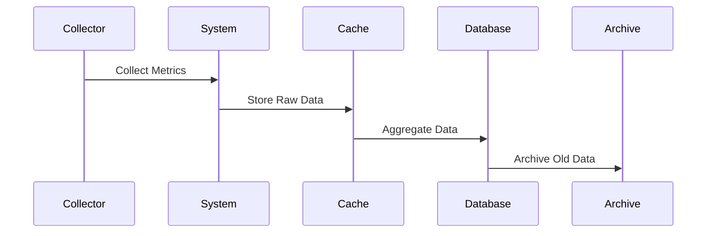
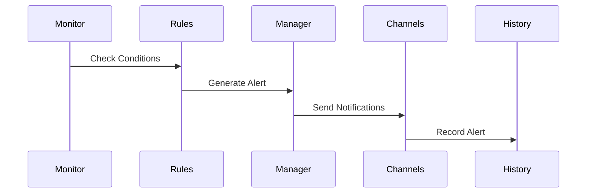
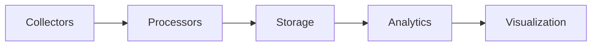

# Terminusa Online Monitoring System Architecture

## System Overview

### Architecture Diagram
```
+------------------------+     +------------------------+     +------------------------+
|    Client Interface    |     |    Monitoring Core    |     |     Data Storage      |
|------------------------|     |------------------------|     |------------------------|
| - Dashboard            |     | - Metric Collector    |     | - PostgreSQL          |
| - WebSocket Client     | <-> | - Alert Manager       | <-> | - Redis Cache         |
| - API Endpoints        |     | - Event System        |     | - File System         |
+------------------------+     +------------------------+     +------------------------+
           ^                            ^                             ^
           |                            |                             |
           v                            v                             v
+------------------------+     +------------------------+     +------------------------+
|    Security Layer      |     |    Service Layer      |     |    Backup System      |
|------------------------|     |------------------------|     |------------------------|
| - Authentication       |     | - System Services     |     | - Backup Manager      |
| - Authorization        |     | - Health Checks       |     | - Recovery System     |
| - Rate Limiting        |     | - Service Discovery   |     | - Archive Manager     |
+------------------------+     +------------------------+     +------------------------+
```

## Core Components

### 1. Metric Collection System
```python
class MetricCollector:
    """
    Collects system and application metrics
    - System resources (CPU, Memory, Disk)
    - Application metrics
    - Custom metrics
    - Performance data
    """
    
    collection_intervals = {
        'system': 60,    # seconds
        'app': 30,       # seconds
        'custom': 300    # seconds
    }
    
    storage_config = {
        'raw': '1d',
        'hourly': '7d',
        'daily': '30d'
    }
```

### 2. Alert Management System
```python
class AlertManager:
    """
    Handles alert generation and notification
    - Alert rules
    - Notification channels
    - Alert history
    - Alert aggregation
    """
    
    alert_levels = {
        'critical': {'timeout': 300, 'channels': ['all']},
        'warning': {'timeout': 1800, 'channels': ['email', 'slack']},
        'info': {'timeout': 3600, 'channels': ['dashboard']}
    }
```

### 3. Data Storage System
```python
class StorageManager:
    """
    Manages data storage and retrieval
    - Metrics storage
    - Alert storage
    - Configuration storage
    - Backup storage
    """
    
    storage_engines = {
        'metrics': 'redis',      # Fast access
        'alerts': 'postgresql',  # Persistent storage
        'config': 'file',       # Local storage
        'backup': 'filesystem'  # Large files
    }
```

## System Layers

### 1. Presentation Layer
- Dashboard Interface
- API Endpoints
- WebSocket Server
- Command Line Interface

### 2. Business Logic Layer
- Metric Processing
- Alert Generation
- Data Aggregation
- System Analysis

### 3. Data Layer
- Data Storage
- Data Retrieval
- Data Backup
- Data Recovery

## Communication Flow

### 1. Metric Collection


### 2. Alert Processing


### 3. Data Flow


## Component Details

### 1. Monitoring Core
```python
# Core configuration
CORE_CONFIG = {
    'workers': 4,
    'queue_size': 1000,
    'batch_size': 100,
    'timeout': 30
}

# Processing pipeline
PIPELINE = [
    'collection',
    'validation',
    'processing',
    'storage',
    'analysis'
]
```

### 2. Storage Systems
```python
# Database schema
SCHEMA = {
    'metrics': {
        'timestamp': 'timestamp',
        'type': 'string',
        'value': 'float',
        'tags': 'jsonb'
    },
    'alerts': {
        'id': 'uuid',
        'severity': 'string',
        'message': 'text',
        'created_at': 'timestamp'
    }
}

# Cache structure
CACHE = {
    'metrics': 'hash',
    'alerts': 'sorted_set',
    'config': 'hash'
}
```

### 3. API Layer
```python
# API endpoints
ENDPOINTS = {
    'metrics': {
        'current': '/metrics/current',
        'historical': '/metrics/history',
        'custom': '/metrics/custom'
    },
    'alerts': {
        'active': '/alerts/active',
        'history': '/alerts/history',
        'acknowledge': '/alerts/{id}/ack'
    }
}
```

## Security Architecture

### 1. Authentication
```python
# Auth configuration
AUTH_CONFIG = {
    'token_expiry': 3600,
    'refresh_window': 300,
    'max_attempts': 5
}

# Access levels
ACCESS_LEVELS = {
    'admin': ['all'],
    'operator': ['read', 'write'],
    'viewer': ['read']
}
```

### 2. Data Protection
```python
# Encryption configuration
ENCRYPTION = {
    'algorithm': 'AES-256-GCM',
    'key_rotation': 90,
    'backup_encryption': True
}

# Data classification
DATA_CLASSES = {
    'public': 'none',
    'internal': 'encrypted',
    'sensitive': 'encrypted+signed'
}
```

## Performance Optimization

### 1. Caching Strategy
```python
# Cache configuration
CACHE_CONFIG = {
    'metrics': {
        'ttl': 3600,
        'max_size': '1GB'
    },
    'alerts': {
        'ttl': 86400,
        'max_size': '100MB'
    }
}
```

### 2. Data Aggregation
```python
# Aggregation rules
AGGREGATION = {
    'intervals': ['1m', '5m', '1h', '1d'],
    'functions': ['avg', 'min', 'max', 'sum'],
    'retention': {
        '1m': '2h',
        '5m': '24h',
        '1h': '7d',
        '1d': '90d'
    }
}
```

## Scalability

### 1. Horizontal Scaling
```python
# Scaling configuration
SCALING = {
    'collectors': {
        'min': 2,
        'max': 10,
        'target_cpu': 70
    },
    'processors': {
        'min': 2,
        'max': 8,
        'target_memory': 80
    }
}
```

### 2. Load Distribution
```python
# Load balancing
LOAD_BALANCE = {
    'algorithm': 'round_robin',
    'health_check': '/health',
    'timeout': 5
}
```

## Deployment Architecture

### 1. Service Configuration
```yaml
# Docker compose configuration
services:
  monitoring:
    image: terminusa/monitoring
    replicas: 2
    resources:
      limits:
        cpu: '2'
        memory: '2G'
```

### 2. Network Configuration
```yaml
# Network setup
networks:
  monitoring:
    driver: overlay
    config:
      - subnet: 172.20.0.0/16
```

## Backup Architecture

### 1. Backup Strategy
```python
# Backup configuration
BACKUP_CONFIG = {
    'schedule': {
        'full': '0 0 * * 0',    # Weekly
        'incremental': '0 0 * * *'  # Daily
    },
    'retention': {
        'full': 90,         # days
        'incremental': 30   # days
    }
}
```

### 2. Recovery Process
```python
# Recovery configuration
RECOVERY_CONFIG = {
    'verification': True,
    'parallel_restore': True,
    'batch_size': 1000
}
```

## Integration Points

### 1. External Systems
```python
# Integration configuration
INTEGRATIONS = {
    'slack': {
        'webhook_url': 'URL',
        'channel': '#monitoring'
    },
    'email': {
        'smtp_host': 'smtp.example.com',
        'smtp_port': 587
    }
}
```

### 2. Internal Systems
```python
# Internal endpoints
INTERNAL_API = {
    'game': 'http://game-service',
    'auth': 'http://auth-service',
    'metrics': 'http://metrics-service'
}
```

## Support Architecture

### 1. Logging System
```python
# Logging configuration
LOGGING = {
    'level': 'INFO',
    'format': 'structured',
    'outputs': ['file', 'syslog']
}
```

### 2. Documentation System
```python
# Documentation structure
DOCS = {
    'api': '/docs/api',
    'setup': '/docs/setup',
    'admin': '/docs/admin',
    'dev': '/docs/dev'
}
