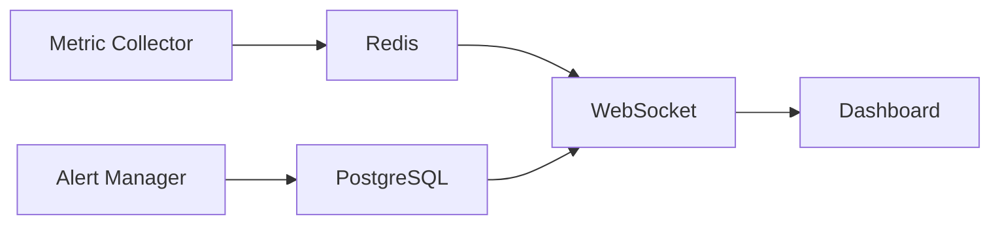

# Terminusa Online Monitoring System Guide

## Overview

The Terminusa Online monitoring system provides comprehensive monitoring, alerting, and management capabilities for the game platform. This guide covers system setup, configuration, and usage.

## Table of Contents

1. [System Architecture](#system-architecture)
2. [Features](#features)
3. [Setup and Configuration](#setup-and-configuration)
4. [Management Commands](#management-commands)
5. [Monitoring Dashboard](#monitoring-dashboard)
6. [Alert System](#alert-system)
7. [Backup and Recovery](#backup-and-recovery)
8. [Advanced Features](#advanced-features)
9. [Troubleshooting](#troubleshooting)

## System Architecture

### Components

- **Metric Collector**: Gathers system and game metrics
- **Alert Manager**: Handles alert generation and notification
- **WebSocket Server**: Provides real-time updates
- **Storage System**: Redis for metrics, PostgreSQL for alerts
- **Dashboard**: Web interface for monitoring

### Data Flow



## Features

### Core Features

- Real-time metric collection
- Multi-channel alerting (Email, Slack, WebSocket)
- Interactive dashboard
- Automated backups
- System health checks

### Advanced Features

- Trend analysis
- Anomaly detection
- Predictive alerts
- Performance optimization
- Metric aggregation

## Setup and Configuration

### Initial Setup

```bash
# Initialize monitoring system
python manage.py init_monitoring

# Configure monitoring services
python manage.py manage_monitoring setup

# Start monitoring services
systemctl start terminusa-monitoring
```

### Configuration Files

- `config/monitoring.py`: Main configuration
- `config/production.py`: Production settings
- `.env`: Environment variables

### Environment Variables

```ini
REDIS_HOST=localhost
REDIS_PORT=6379
EMAIL_HOST=smtp.example.com
EMAIL_PORT=587
SLACK_WEBHOOK_URL=https://hooks.slack.com/...
```

## Management Commands

### Basic Commands

```bash
# Show monitoring status
python manage.py manage_monitoring status

# Start/stop monitoring
python manage.py manage_monitoring start
python manage.py manage_monitoring stop

# Create backup
python manage.py backup_monitoring

# Restore from backup
python manage.py restore_monitoring
```

### Advanced Commands

```bash
# Cleanup old data
python manage.py manage_monitoring cleanup --days=30

# Test alerts
python manage.py manage_monitoring test-alerts

# Reset configuration
python manage.py manage_monitoring reset-config
```

## Monitoring Dashboard

### Access

- URL: https://terminusa.online/admin/monitoring
- Authentication: Admin API key required

### Features

1. **System Overview**
   - CPU, Memory, Disk usage
   - Network traffic
   - Service status

2. **Game Metrics**
   - Active players
   - Active wars
   - Transaction rates
   - Response times

3. **Alert Management**
   - Active alerts
   - Alert history
   - Alert acknowledgment

4. **Performance Analytics**
   - Resource trends
   - System health
   - Performance patterns

## Alert System

### Alert Levels

1. **Critical**
   - Immediate action required
   - All channels notified
   - Auto-escalation after 5 minutes

2. **Warning**
   - Action needed soon
   - Standard notification
   - No auto-escalation

3. **Info**
   - Informational only
   - Dashboard display only

### Alert Channels

1. **Email**
   ```python
   EMAIL_CONFIG = {
       'enabled': True,
       'from': 'monitoring@terminusa.online',
       'recipients': ['admin@terminusa.online']
   }
   ```

2. **Slack**
   ```python
   SLACK_CONFIG = {
       'enabled': True,
       'webhook_url': 'WEBHOOK_URL',
       'channel': '#monitoring'
   }
   ```

3. **WebSocket**
   ```python
   WEBSOCKET_CONFIG = {
       'enabled': True,
       'url': 'wss://terminusa.online/ws/monitoring'
   }
   ```

## Backup and Recovery

### Backup Types

1. **Full Backup**
   ```bash
   python manage.py backup_monitoring --type=full
   ```

2. **Partial Backup**
   ```bash
   python manage.py backup_monitoring --type=metrics
   python manage.py backup_monitoring --type=alerts
   python manage.py backup_monitoring --type=config
   ```

### Recovery

```bash
# List available backups
python manage.py restore_monitoring --list

# Restore from specific backup
python manage.py restore_monitoring --backup-dir=/path/to/backup

# Dry run
python manage.py restore_monitoring --dry-run
```

## Advanced Features

### Trend Analysis

```python
TREND_CONFIG = {
    'windows': {
        'short': '1h',
        'medium': '1d',
        'long': '7d'
    },
    'threshold': 0.8
}
```

### Anomaly Detection

```python
ANOMALY_CONFIG = {
    'z_score_threshold': 3.0,
    'min_samples': 30,
    'learning_rate': 0.1
}
```

### Predictive Alerts

```python
PREDICTION_CONFIG = {
    'forecast_hours': 24,
    'confidence_threshold': 0.8,
    'min_samples': 100
}
```

### Performance Optimization

```python
OPTIMIZATION_CONFIG = {
    'metric_retention': {
        'raw': '1d',
        'hourly': '7d',
        'daily': '30d'
    },
    'compression_threshold': '1MB'
}
```

## Troubleshooting

### Common Issues

1. **High Resource Usage**
   - Check system metrics
   - Review active processes
   - Monitor trends

2. **Alert Flooding**
   - Review thresholds
   - Check throttling
   - Adjust grouping

3. **Slow Dashboard**
   - Check browser resources
   - Verify network connection
   - Monitor WebSocket status

### Debug Mode

```python
# Enable debug logging
LOG_CONFIG['file']['level'] = 'DEBUG'
```

### Log Files

- Application logs: `/var/log/terminusa/app.log`
- Monitoring logs: `/var/log/terminusa/monitoring.log`
- Alert logs: `/var/log/terminusa/alerts.log`

### Support

For additional support:
1. Check monitoring dashboard
2. Review system logs
3. Contact: admin@terminusa.online

## Best Practices

### Monitoring

1. **Regular Checks**
   - Review dashboard daily
   - Monitor trends
   - Check alerts promptly

2. **Maintenance**
   - Regular backups
   - Log rotation
   - Metric cleanup

3. **Performance**
   - Monitor resource usage
   - Optimize queries
   - Manage storage

### Security

1. **Access Control**
   - Admin API keys
   - IP restrictions
   - Role-based access

2. **Data Protection**
   - Encrypted connections
   - Secure storage
   - Regular audits

### Updates

1. **System Updates**
   - Regular patches
   - Security updates
   - Feature updates

2. **Documentation**
   - Keep updated
   - Record changes
   - Share knowledge
